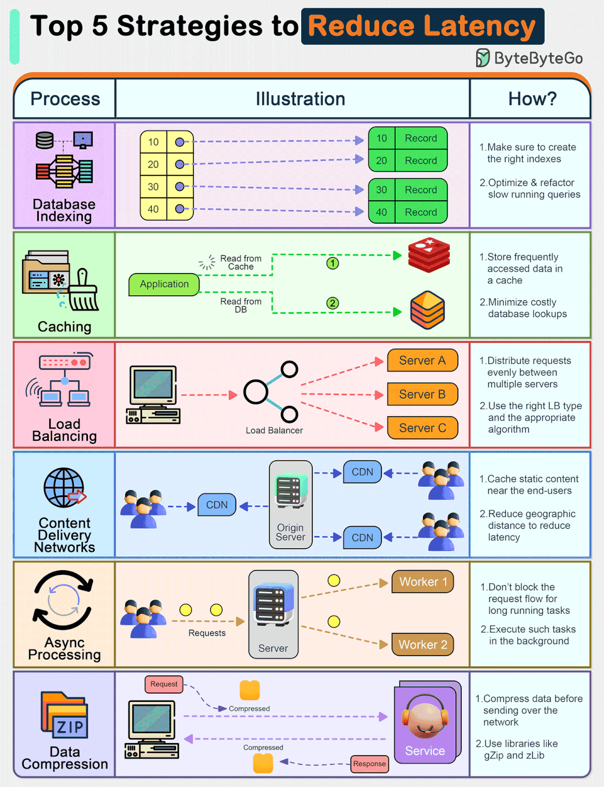

# Matrice decisionale

---

Ecco una **matrice delle decisioni** semplice e modulare che puoi **riutilizzare per ogni tuo progetto**, adattandola a seconda del contesto (web app, gioco, API, etc).

---

## ✅ **Matrice delle Decisioni Protocollo & Stack Tecnologico**

| **Criterio**                  | **Valore**                     | **Scelte consigliate (Livelli OSI / Tecnologie)**                                                     |
| ----------------------------- | ------------------------------ | ----------------------------------------------------------------------------------------------------- |
| 🔁 Tempo reale                | ✅ Sì                          | Livello 5: **WebSocket**, **UDP**, **RTP** Livello 7: **gRPC streaming**, **RSocket**, **SignalR** |
| 🌐 Compatibilità browser      | ✅ Alta                        | Livello 7: **HTTP/HTTPS**, **REST**, **GraphQL** Livello 4: **TCP**, HTTP/2/3                      |
| 🔐 Sicurezza sensibile        | ✅ Obbligatoria                | Livello 6: **TLS/SSL** Livello 7: **OAuth2**, **HTTPS**, **JWT**, **SOAP**                         |
| 🧠 Logica business complesse  | ✅ Presente                    | Livello 7: **GraphQL**, **gRPC**, **REST** Pattern: **CQRS**, **BFF**                              |
| 📊 Alto throughput            | ✅ Richiesto                   | Livello 4: **HTTP/2**, **QUIC**, **TCP** Livello 7: **gRPC**, **binary protocol**, **Protobuf**    |
| 🧩 Microservizi               | ✅ Struttura modulare          | **gRPC**, **REST**, **Event-driven (AMQP, MQTT, Kafka)**                                              |
| 🧮 Latenza minima             | ✅ Critica                     | **UDP**, **WebSocket**, **QUIC**, **gRPC streaming**, **TCP tuning**                                  |
| 🔌 Dispositivi limitati (IoT) | ✅ Target low power / mobile   | Livello 7: **MQTT**, **CoAP** Livello 4: **UDP**                                                   |
| 📦 Compatibilità legacy       | ✅ Necessaria                  | Livello 7: **SOAP**, **XML-RPC**, **FTP**, **POP3**, **IMAP**, **SMTP**                               |
| 🔄 Messaggistica/Push         | ✅ Notifiche o flussi continui | **WebSocket**, **MQTT**, **Server Sent Events (SSE)**, **RSocket**, **STOMP**                         |

---

## Lista di alcuni esempi pratici

---

## 🧪 Esempio pratico: FPS Multiplayer

| Criterio                  | Valore         | Tecnologie                              |
| ------------------------- | -------------- | --------------------------------------- |
| Tempo reale               | ✅             | UDP, WebSocket, RSocket                 |
| Compatibilità browser     | ❌             | Ignorabile se è un gioco nativo         |
| Sicurezza sensibile       | ❌             | Solo anti-cheat, non dati personali     |
| Logica business complessa | ❌             | Poca logica, solo sincronizzazione      |
| Alto throughput           | ✅             | UDP, QUIC                               |
| Microservizi              | ❌ (opzionale) | Non necessario in versione client-side  |
| Latenza minima            | ✅✅✅         | UDP assoluto must                       |
| Dispositivi limitati      | ❌             | Target: PC / Console                    |
| Compatibilità legacy      | ❌             | Nessuna esigenza                        |
| Messaggistica/Push        | ✅             | WebSocket per sincronizzazione costante |

---

## 🛒 E-commerce (Web App)

| **Criterio**               | **Valore**          | **Tecnologie consigliate**                                            |
| -------------------------- | ------------------- | --------------------------------------------------------------------- |
| Tempo reale                | ❌ (opzionale)      | Eventuale uso di WebSocket/SSE per aggiornamento stock in tempo reale |
| Compatibilità browser      | ✅ Altissima        | HTTP/HTTPS, REST API, GraphQL frontend                                |
| Sicurezza sensibile        | ✅ Obbligatoria     | HTTPS, TLS, OAuth2, JWT, PCI-DSS compliance                           |
| Logica business complessa  | ✅                  | GraphQL per personalizzazione ricerche, REST per ordini/pagamenti     |
| Alto throughput            | ✅ (Checkout)       | HTTP/2, QUIC se disponibile, TCP ottimizzato                          |
| Microservizi               | ✅ (Consigliati)    | Microservizi REST/gRPC per ordini, magazzino, pagamento               |
| Latenza minima             | ⚪ Medio-importante | Ottimizzazione caching CDN, QUIC per page-load                        |
| Dispositivi limitati (IoT) | ❌                  | Focus desktop/mobile browser standard                                 |
| Compatibilità legacy       | ⚪                  | Eventuale supporto vecchi browser tramite fallback                    |
| Messaggistica/Push         | ✅ (opzionale)      | WebSocket o Push Notifications per tracking ordini                    |

---

## 🌍 Sito Statico

| **Criterio**               | **Valore**     | **Tecnologie consigliate**              |
| -------------------------- | -------------- | --------------------------------------- |
| Tempo reale                | ❌             | Non richiesto                           |
| Compatibilità browser      | ✅ Massima     | HTTP/HTTPS, TCP                         |
| Sicurezza sensibile        | ✅ (Minima)    | HTTPS, TLS                              |
| Logica business complessa  | ❌             | Nessuna logica server-side              |
| Alto throughput            | ✅             | HTTP/2, QUIC, CDN caching               |
| Microservizi               | ❌             | Non applicabile                         |
| Latenza minima             | ✅ (Page load) | Static site generator + CDN             |
| Dispositivi limitati (IoT) | ❌             | Non applicabile                         |
| Compatibilità legacy       | ✅             | Ampio supporto per browser anche vecchi |
| Messaggistica/Push         | ❌             | Non necessario                          |

---

## 🔥 Sito Dinamico (tipo blog con CMS, o dashboard)

| **Criterio**               | **Valore**         | **Tecnologie consigliate**                                        |
| -------------------------- | ------------------ | ----------------------------------------------------------------- |
| Tempo reale                | ⚪ (Dipende)       | Eventuale aggiornamento live con WebSocket/SSE per dashboard      |
| Compatibilità browser      | ✅                 | HTTP/HTTPS, REST API                                              |
| Sicurezza sensibile        | ✅                 | HTTPS, TLS, gestione auth sicura                                  |
| Logica business complessa  | ✅                 | REST API o GraphQL per gestire dati dinamici                      |
| Alto throughput            | ⚪                 | Ottimizzazione caching server e browser                           |
| Microservizi               | ❌ (monolitico ok) | Dipende dalla scala (Laravel, Django, Next.js SSR)                |
| Latenza minima             | ⚪                 | Ottimizzazione page load più che latenza "wire to wire"           |
| Dispositivi limitati (IoT) | ❌                 | Desktop e mobile browser normali                                  |
| Compatibilità legacy       | ⚪                 | Dipende dal target (es. se azienda interna, solo browser moderni) |
| Messaggistica/Push         | ⚪ (opzionale)     | Solo se si vuole supportare notifiche via Web Push                |

---

## 📝 CMS (Content Management System)

| **Criterio**               | **Valore**        | **Tecnologie consigliate**                                                 |
| -------------------------- | ----------------- | -------------------------------------------------------------------------- |
| Tempo reale                | ⚪ (opzionale)    | WebSocket o SSE per notifiche live (es. nuovo commento)                    |
| Compatibilità browser      | ✅ Altissima      | HTTP/HTTPS, REST API o GraphQL per estensioni headless                     |
| Sicurezza sensibile        | ✅ Obbligatoria   | HTTPS, TLS, OAuth2 login, CSRF/XSS protection                              |
| Logica business complessa  | ⚪ Moderata       | REST API o GraphQL per gestione post/articoli/tag                          |
| Alto throughput            | ⚪                | HTTP/2 e caching per ridurre i tempi di caricamento                        |
| Microservizi               | ❌ (in genere no) | Solitamente monolitico, ma alcuni CMS moderni possono scalare (es. Strapi) |
| Latenza minima             | ⚪                | Importante solo lato admin/editor per reattività                           |
| Dispositivi limitati (IoT) | ❌                | Focus normale su desktop/tablet/mobile browser                             |
| Compatibilità legacy       | ✅                | Deve supportare browser aziendali anche vecchi                             |
| Messaggistica/Push         | ⚪ (opzionale)    | Push Notifications solo se si vuole avvisare admin/editor                  |

---

## 🏢 CRM (Customer Relationship Management)

| **Criterio**               | **Valore**      | **Tecnologie consigliate**                                    |
| -------------------------- | --------------- | ------------------------------------------------------------- |
| Tempo reale                | ✅ (importante) | WebSocket, Webhook, o EventBus interno                        |
| Compatibilità browser      | ✅ Alta         | HTTP/HTTPS, REST API, GraphQL per applicazioni web            |
| Sicurezza sensibile        | ✅ Altissima    | HTTPS, OAuth2, SSO, RBAC (role-based access control), MFA     |
| Logica business complessa  | ✅ Complessa    | GraphQL per gestire query complesse tra clienti, ordini, lead |
| Alto throughput            | ✅ (data sync)  | HTTP/2, WebSocket per sincronizzazione rapida dati            |
| Microservizi               | ✅ Consigliato  | Microservizi per gestione account, lead, marketing, reporting |
| Latenza minima             | ⚪ Media        | Importante per dashboard in tempo reale                       |
| Dispositivi limitati (IoT) | ❌              | Solo browser e mobile app                                     |
| Compatibilità legacy       | ⚪              | Alcune aziende richiedono supporto vecchi sistemi             |
| Messaggistica/Push         | ✅ (critica)    | Push Notification per aggiornamenti su clienti, lead, ticket  |

---

## 🏭 ERP (Enterprise Resource Planning)

| **Criterio**               | **Valore**      | **Tecnologie consigliate**                                       |
| -------------------------- | --------------- | ---------------------------------------------------------------- |
| Tempo reale                | ✅ (importante) | WebSocket, gRPC, Event Streams                                   |
| Compatibilità browser      | ⚪ (interno)    | HTTP/HTTPS (solo per accessi web), spesso app desktop            |
| Sicurezza sensibile        | ✅ Altissima    | HTTPS, VPN, SSO aziendale, RBAC, MFA                             |
| Logica business complessa  | ✅ Estrema      | GraphQL o API interne, batch processing, EDI                     |
| Alto throughput            | ✅ (molto)      | gRPC, WebSocket, TCP tuning                                      |
| Microservizi               | ✅ Obbligatorio | Moduli separati per contabilità, HR, produzione, logistica       |
| Latenza minima             | ⚪ Media        | Importante ma tollerabile nei task batch                         |
| Dispositivi limitati (IoT) | ⚪ (opzionale)  | Alcune integrazioni con dispositivi barcode, IoT aziendali       |
| Compatibilità legacy       | ✅ Necessaria   | Spesso devono dialogare con vecchi sistemi AS400, SAP-R3         |
| Messaggistica/Push         | ✅ (interno)    | Event Streams, Push Notification su alert logistici o produttivi |

---

## 🛠️ RMM (Remote Monitoring and Management)

| **Criterio**               | **Valore**      | **Tecnologie consigliate**                                    |
| -------------------------- | --------------- | ------------------------------------------------------------- |
| Tempo reale                | ✅ Fondamentale | WebSocket, SNMP traps, gRPC                                   |
| Compatibilità browser      | ✅ Alta         | Web app via HTTPS, Accesso sicuro da browser                  |
| Sicurezza sensibile        | ✅ Altissima    | HTTPS, TLS, VPN, MFA (Multi-Factor Authentication)            |
| Logica business complessa  | ⚪ Media        | API REST standard, notifiche in tempo reale                   |
| Alto throughput            | ⚪ Limitato     | Non necessario su ampi volumi, focus su affidabilità          |
| Microservizi               | ✅ Consigliato  | Separazione di moduli (monitoring, patching, alerting)        |
| Latenza minima             | ✅ (Critica)    | Risposte rapide necessarie per monitoraggio                   |
| Dispositivi limitati (IoT) | ✅ (opzionale)  | Supporto per stampanti, router, NAS, IoT devices aziendali    |
| Compatibilità legacy       | ✅ Necessaria   | Deve supportare sistemi Windows XP, server vecchi, reti miste |
| Messaggistica/Push         | ✅ Critica      | Push notifiche alert, SNMP Trap, Webhooks                     |

---

## 📋 PSA (Professional Services Automation)

| **Criterio**               | **Valore**        | **Tecnologie consigliate**                                        |
| -------------------------- | ----------------- | ----------------------------------------------------------------- |
| Tempo reale                | ⚪ Utile          | WebSocket per dashboard live, polling REST                        |
| Compatibilità browser      | ✅ Totale         | Full Web App (SPA o MPA) su HTTPS                                 |
| Sicurezza sensibile        | ✅ Alta           | HTTPS, SSO, RBAC (Ruoli utenti), MFA                              |
| Logica business complessa  | ✅ Molto alta     | Sistemi di gestione ticket, contratti, time tracking complessi    |
| Alto throughput            | ⚪ Limitato       | Lavoro su dati gestionali e documenti, non su file binari pesanti |
| Microservizi               | ⚪ Possibile      | Scalabile modularmente (es: ticketing, billing separati)          |
| Latenza minima             | ⚪ Bassa priorità | Operazioni asincrone ammissibili                                  |
| Dispositivi limitati (IoT) | ❌ No             | Solo accesso da device standard (PC, tablet)                      |
| Compatibilità legacy       | ⚪ Parziale       | Integrazione con CRM, ERP, Billing legacy tramite API REST        |
| Messaggistica/Push         | ✅ Utile          | Notifiche email, push mobile per nuovi ticket, alert scadenze     |

---

# 🎯 Tabella riepilogativa finale

| **Sistema/Applicazione**  | **Focus principale**                   | **Protocolli chiave**                         |
| ------------------------- | -------------------------------------- | --------------------------------------------- |
| **FPS Multiplayer**       | Latenza minima + Tempo reale           | UDP, WebSocket, RSocket                       |
| **E-commerce**            | Sicurezza + Throughput                 | HTTPS, REST, GraphQL, WebSocket               |
| **Sito Statico**          | Compatibilità + Velocità               | HTTPS, HTTP/2, QUIC, CDN                      |
| **Sito Dinamico**         | Sicurezza + Dati dinamici              | HTTPS, REST, WebSocket (opzionale)            |
| **CMS** (es. WordPress)   | Compatibilità + Dati dinamici          | HTTPS, REST API, GraphQL                      |
| **CRM** (es. Salesforce)  | Sicurezza + Aggiornamenti real-time    | HTTPS, WebSocket, REST, GraphQL               |
| **ERP** (es. SAP, Odoo)   | Sicurezza + Microservizi + Throughput  | gRPC, WebSocket, HTTPS, Event Streams         |
| **RMM** (es. Atera)       | Tempo reale + Monitoraggio leggero     | WebSocket, gRPC, HTTPS                        |
| **PSA** (es. ConnectWise) | Sicurezza + Tracciabilità dei processi | HTTPS, REST API, WebSocket                    |
| **MMO RPG** (es. WoW)     | Tempo reale + Persistenza dati         | UDP (movimento), TCP/WebSocket (chat, eventi) |

---

**Nota**:

- Dove servono **prestazioni altissime** (tipo MMO, FPS) ➔ **UDP + WebSocket** è dominante.
- Dove servono **sicurezza e compatibilità browser** (CMS, CRM, PSA) ➔ **HTTPS + REST/GraphQL**.
- Dove servono **microservizi interni veloci** (ERP) ➔ **gRPC** batte tutto.

---

## Ottimizzazione della comunicazione:

---
